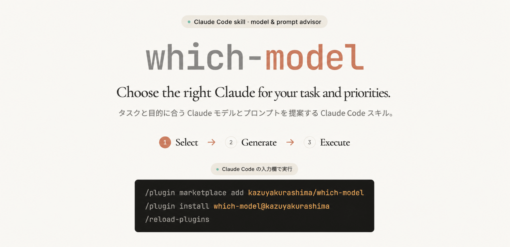

<div align="center">

# which-model

**やりたいことを Claude に伝えると、次の2つを提案する Claude Code 用 skill。**

</div>

**①** タスクに最適なモデルと effort を“理由つき”で<br>
**②** そのモデルに最適化したプロンプト

<div align="center">

提示で止まり <kbd>y</kbd> で実行——切替も実行も、**常にあなたの手に**。

**[すぐ試す](#クイックスタート)** ・ [これは何をするか](#これは何をするか) ・ [仕組み](#仕組み料理人とレシピ本)

</div>



<div align="center">

※ Anthropic 非公式の個人プロジェクト。自動切替はしません（[詳細](#免責非公式について)）。

</div>

<details>
<summary><b>動作例（デモ）を見る</b> — 実際の3ステップのスクリーンショット（クリックで展開）</summary>

「ログインの仕組みを、壊れないように少しずつ確認しながら全部作り直したい」と依頼した実際の流れです。

**1. 依頼する（`/which-model` に、やりたいことを普段どおり書くだけ）**


**2. フェーズ1：推奨モデルと effort が理由つきで提示され、いったん停止する**


**3. `y` を送ると、フェーズ2：確定モデル向けに最適化したプロンプトが表示される（まだ実行はしない）**


*（上は冒頭のみ。実際は `Fixed instruction` / `Variables` / `Output format` / `Verification` の全文が続きます。）*

このあと、確定モデルが今のモデルと違えば `/model claude-fable-5` で切り替え、**もう一度 `y`**（または表示された
プロンプトを編集して送信）で初めて実行されます。ポイントは **「提示 → （必要なら）切替 → `y` で実行」
の一拍**。skill は稼働中は読み取り専用で、勝手にコードを触りません。

</details>

## クイックスタート

この配布リポジトリを clone（またはダウンロード）して、導入先プロジェクトを引数に `install.sh` を
実行するだけです。

```sh
git clone https://github.com/kazuyakurashima/which-model.git
cd which-model
./install.sh <導入先プロジェクトのパス>
```

<details>
<summary><b>これで設置完了。</b>あとは Claude Code で <code>/which-model &lt;やりたいこと&gt;</code> と打つだけ（設置場所・コマンドの意味を詳しく）</summary>

`install.sh` は次の2つを配置します。

- **`SKILL.md`（skill の動作指示）** → `~/.claude/skills/which-model/`（1回で全プロジェクト共通）
- **`docs/ai-model-guides/`（モデル選定の判断材料）** → 導入先プロジェクトの `docs/`（プロジェクトごと）

上の3行のコマンドの意味（ターミナルに不慣れな方へ）：

- **`git clone https://github.com/...`** … このプロジェクト一式を、あなたの PC にコピー（複製）します。`git`
  というバージョン管理ツールが必要です（未導入なら「Git インストール」で検索）。GitHub の「Code ▾ →
  Download ZIP」でダウンロードしても代用できます。
- **`cd which-model`** … `cd` は "change directory"（フォルダの移動）の意味。いまコピーした
  フォルダの中に入ります。
- **`./install.sh <導入先プロジェクトのパス>`** … 付属のセットアップスクリプトを実行します。
  `<導入先プロジェクトのパス>` は、この skill を使いたい自分のプロジェクトのフォルダ
  （例：`~/dev/my-app`）に置き換えます。

手動設置・Windows（`./install.sh` が使えない場合）・引数なし実行などは、下の[セットアップ（詳細）](#セットアップ詳細)を参照してください。

</details>

## 目次

上の**概要図 → 動作例 → クイックスタート**が最重要の3つです。もっと知りたいときは、以下から必要な項目へ。

- [これは何をするか](#これは何をするか)
- [仕組み（料理人とレシピ本）](#仕組み料理人とレシピ本)
- [セットアップ（詳細）](#セットアップ詳細)
- [使い方とコツ](#使い方とコツ)
- [設計上の割り切り（既知の制約）](#設計上の割り切り既知の制約)
- [カスタマイズ（配布を受けた人向け）](#カスタマイズ配布を受けた人向け)
- [付録：CLAUDE.md 追記スニペット](#付録claudemd-追記スニペット任意本運用では非推奨)
- [ライセンス](#ライセンス)
- [免責・非公式について](#免責非公式について)

## これは何をするか

Claude Code で開発していると、指示のたびに「どのモデルが最適か」「プロンプトをそのモデル向けに
どう書くか」で迷い、選定を誤ると手戻りが起きます。この skill は、その2つを半自動化します。

1. あなたが `/which-model <指示>` と入力する
2. skill が指示内容（設計・実装・リファクタ等）と複雑さを判定し、推奨モデルと effort を理由つきで提示して停止する
3. 確定合図を送る（**この時点ではまだモデルを切り替えない**）
   - 推奨モデルのまま → `y`
   - 代替モデルにする → `y opus` / `y fable` / `y sonnet` とモデル名を添える
   - skill は今動いているモデルのまま、確定したモデル向けに最適化したプロンプトを生成し表示して**いったん停止する**
4. 確定モデルが今のモデルと違うときだけ、ここで `/model` を切り替える（同じなら不要）
5. 中身を確認し、よければ**もう一度 `y`** を送ると実行される（コピペ不要）。直したいときは表示されたプロンプトを編集して送る

この「表示 → 切替 → `y` で実行」の一拍が暴走を防ぎます。モデル切替を実行直前の1回だけにしているのは、
切替先モデル（特に長時間実行向けの Fable 5）をプロンプト整形という軽作業のためだけに使わないため。
プロンプト最適化は常に、今起動している（切替前の）モデルが行います。

## 仕組み（料理人とレシピ本）

### 概要

**料理にたとえると分かりやすい**です。この skill は「**料理人**」と「**レシピ本**」の2つでできている、
と考えてください。

- **料理人（`SKILL.md`）** … 動作の段取りだけを書いた、Claude への指示書。PC 本体に1つだけ置く（全プロジェクト共通）。
- **レシピ本（`docs/ai-model-guides/`）** … どのモデルをどう使うかの判断材料。プロジェクトごとに置く。

料理人は判断材料を自分では持たず、開いているプロジェクトのレシピ本を読んで「このタスクはどのモデル・
どの effort が最適か」を判断します。だから**プロジェクトごとに基準を微調整でき、モデルの世代交代にも
レシピ本を差し替えるだけで追従できます**。料理人はどのキッチン（プロジェクト）でも共通、レシピ本は
キッチンごとに置く——とイメージすると掴みやすいはずです。

### 詳細

<details>
<summary>レシピ本の中身（6ファイル）・タグの意味・補足を開く</summary>

レシピ本（`docs/ai-model-guides/`）は6ファイル構成です。

| ファイル | 役割 |
| --- | --- |
| `00_index.md` | 全体の使い方・読み込みルール |
| `01_sources_evidence.md` | 根拠台帳（公式主張を source_id で管理） |
| `02_model_selection_matrix.md` | タスク別のモデル/effort 判断表（SKILL.md が毎回読む中核） |
| `03_fable5_prompting.md` | Fable 5 向けプロンプト最適化ガイド |
| `04_opus48_prompting.md` | Opus 4.8 向けプロンプト最適化ガイド |
| `05_sonnet5_prompting.md` | Sonnet 5 向けプロンプト最適化ガイド |

各ガイドの記述には2種類のタグが付いています。`[Official]` は Anthropic 公式ドキュメントで
裏付けられた事実（`01` の source_id に対応）、`[Heuristic]` は配布元の運用仮説（公式の裏付けなし、
Confidence 付き）です。使う人は `[Heuristic]` を自分の使い方に合わせて書き換えてください。

> このリポジトリの `README.md` は人間向けの説明書で、Claude Code は読み込みません（トークンを
> 消費しません）。Claude への動作指示は `SKILL.md` に、判断材料は `docs/ai-model-guides/` にあります。
> なお `tools/CODEX_VERIFICATION_PROMPT.md` は配布物ではない開発用ファイル（知識ベースの独立監査用
> プロンプト）で、各プロジェクトへはコピーしません。

</details>

## セットアップ（詳細）

[クイックスタート](#クイックスタート)の `./install.sh <導入先プロジェクト>` で両方そろいますが、
手動設置や Windows では次のようにします。

### SKILL.md（料理人）

**このリポジトリの `SKILL.md` が正本**です。`./install.sh`（引数なし）を実行すると
`~/.claude/skills/which-model/SKILL.md` へ同期されます（既存と差分があれば表示して確認）。
手動で置く場合の場所：

- **Mac**：`~/.claude/skills/which-model/SKILL.md`
- **Windows**：`%USERPROFILE%\.claude\skills\which-model\SKILL.md`

SKILL.md を編集するときは必ずリポジトリ側を直し、`./install.sh` で反映してください。
（`.prettierignore` で SKILL.md を除外しています。Markdown 自動整形が手順のネスト構造を壊すためです。）

### docs/ai-model-guides/（レシピ本）

`./install.sh <導入先プロジェクト>` を使えばレシピ本もコピーされます（引数なしだと SKILL.md のみ）。
手動で置く場合は、導入先プロジェクトのルートに `docs/ai-model-guides/` を作り、6ファイルを置きます。

```
<your-project>/
  docs/
    ai-model-guides/
      00_index.md
      01_sources_evidence.md
      02_model_selection_matrix.md
      03_fable5_prompting.md
      04_opus48_prompting.md
      05_sonnet5_prompting.md
```

シェルでディレクトリごとコピーする例（`<this-repo>` = clone したこの配布リポジトリ、
`<your-project>` = 導入先プロジェクト。いずれもプレースホルダ）：

```sh
# Mac / Linux（bash）
cp -r <this-repo>/docs/ai-model-guides <your-project>/docs/
```

```powershell
# Windows（PowerShell）。install.sh は bash 用なので Windows では手動コピーになります
Copy-Item -Recurse <this-repo>\docs\ai-model-guides <your-project>\docs\
```

## 使い方とコツ

迷ったとき・重要な設計や大規模作業のときだけ、明示的に呼びます。普段の軽い作業では呼ばず、
設定済みのモデルでそのまま指示すれば十分です。

```
/which-model 複数ユーザー対応のタスク管理アプリを設計して
```

推奨が提示され停止したら、モデルはまだ切り替えずに確定合図を送ります（推奨のまま `y`、
代替に変えたら `y opus` / `y fable` / `y sonnet`）。すると今のモデルのまま最適化された
プロンプトが表示されて停止するので、確定モデルが今のモデルと違えば `/model claude-fable-5`
などで切り替え、中身を確認して**もう一度 `y`** を送れば実行されます。

呼び方のコツ：

- **必ず行頭に `/which-model` を付けて呼ぶ。** うしろは、やりたいことを普段どおり書くだけでよい
  （例：`/which-model 認証まわりを大規模リファクタして`）。「リファクタして」のような実行命令の
  ままでよく、skill が起動していれば実行はせず「推奨モデル＋最適化プロンプト」を返して止まります
  （止まるのは SKILL.md の絶対規則によるものです。技術的に実行できないわけではありません）。
- **提案が出ず、いきなり作業（ファイル編集など）が始まったら、skill が起動していないサイン。**
  一度止めて、`/which-model …` を行頭単独で打ち直します。
- スラッシュを使わず自然文で呼ぶときは、「どのモデルがいい？」「〜用のプロンプトにして」のように
  “実行” ではなく “提案・最適化” を求める言い回しにすると起動しやすいです。

なお **CLAUDE.md には登録しないことを推奨**します。登録すると毎回自動で判定が走り、日々の開発
テンポを損なうためです（それでも常時参照させたい場合のスニペットは[付録](#付録claudemd-追記スニペット任意本運用では非推奨)を参照）。

## 設計上の割り切り（既知の制約）

現状の Claude Code の仕様と、この skill の設計上、以下を理解した上で使ってください。

- **モデルの自動切替はできない**。skill は推奨を提示するのみで、`/model` での切替はユーザーが
  手動で行います（2026-07 時点の Claude Code の仕様。公式ドキュメントの明文根拠は未確認）。
- **現在のモデルを skill 側から知る手段がない**ため、モデル不一致の自動警告はできません。
- **提示後にポップアップ（AskUserQuestion）を出さない設計**にしています。ポップアップが出ると
  入力欄が塞がれ、モデル切替ができなくなるためです。代わりに一度停止し、`y` を実行の合図とします。
- **skill は読み取り専用ではありません**。`allowed-tools: Read` は Read を事前許可する設定で、
  他のツールを禁止するものではありません。提示だけで止まるのは SKILL.md の絶対規則に従っているため
  であって、技術的な制約ではありません。
- **判定に時間がかかることがあります**。実測では、提示まで数十秒〜2分超かかった例がありました。
  指示の文字数との単純な比例は見られず、セッションのコンテキスト量や effort も影響している
  可能性があります（未検証）。急ぐときは会話履歴の浅いセッションか、軽いモデルで呼んでください。

## カスタマイズ（配布を受けた人向け）

- `docs/ai-model-guides/02_model_selection_matrix.md` の判断表と、各ガイド（03〜05）を、
  自分のプロジェクトの事情（扱うデータ、作るアプリの種類、コスト方針）に合わせて調整してください。
- `[Heuristic]` タグの記述は配布元の経験則です。自分の使い方に合わせて書き換えてください。
- `[Official]` タグの記述は公式裏付けがあります。モデル世代が変わるまで基本そのままで問題ありません。
- 各ファイル冒頭の `Last verified` 日付が古くなったら（目安：1〜2ヶ月）、公式ドキュメントで
  再確認してください。モデルの仕様・価格は頻繁に変わります。

## 付録：CLAUDE.md 追記スニペット（任意・本運用では非推奨）

上記の通り本運用では CLAUDE.md への登録は推奨しませんが、skill を使わず常時参照させたい
場合は以下を CLAUDE.md に貼ってください。各行は `02_model_selection_matrix.md` の
記述の要約です（根拠：S1, S6, S7, S9, S10, S16, S25, S29, S65, S67, S68。うち「速い対話・高頻度は
Sonnet 5 / Fable 5 不使用」と「ZDR 前提の代替モデル選択」は公式事実から導く運用判断（`[Heuristic]`）。
タグ・source_id はランタイムのノイズになるため省略。裏付けは `01_sources_evidence.md` を参照）。

```md
## Model routing & prompt optimization

When choosing which Claude model to use, or optimizing a prompt for a specific
model, consult these guides. Read only the file relevant to the current task —
do not load all of them.

- Deciding which model for a task → docs/ai-model-guides/02_model_selection_matrix.md
- Prompting Fable 5 (claude-fable-5) → docs/ai-model-guides/03_fable5_prompting.md
- Prompting Opus 4.8 (claude-opus-4-8) → docs/ai-model-guides/04_opus48_prompting.md
- Prompting Sonnet 5 (claude-sonnet-5) → docs/ai-model-guides/05_sonnet5_prompting.md

Quick defaults:
- Unsure / complex agentic coding → Opus 4.8 (default). Effort defaults to high;
  set xhigh explicitly for coding and high-autonomy work (official guidance).
- Fast, high-frequency, or simple → Sonnet 5 (effort=low for simple lookups). Do not use Fable 5 for these.
- Long, ambiguous, hours-to-weeks, end-to-end → Fable 5 (start at effort=high). Set up timeouts,
  progress, and refusal fallback first (Claude Code falls back automatically).
- If something goes wrong, check context first (prompt clarity, CLAUDE.md, task scope) before
  touching model/effort — the fix is often upstream, not a knob.
- Still not working? Diagnose: skipped a file / didn't run tests / didn't double-check → raise
  effort. Had all the context and clearly tried, still wrong → switch to a larger model.
- Sensitive data under ZDR → avoid Fable 5 (ZDR-ineligible); use Opus 4.8 or Sonnet 5.

All `[Official]` claims are backed by docs/ai-model-guides/01_sources_evidence.md.
```

## ライセンス

このプロジェクトは [Apache License 2.0](./LICENSE) で公開されています。無料で利用・改変・
再配布・商用利用ができます（詳細は `LICENSE` を参照）。

## 免責・非公式について

> **これは Anthropic 非公式の個人プロジェクトです。** Anthropic 社およびその公式製品とは
> 関係ありません（"Claude" は Anthropic の商標です）。掲載する各モデルの仕様・価格は
> `[Official]` タグの範囲で公式ドキュメントに基づきますが、本 skill 自体は公式のものでは
> ありません。本ライセンスは商標の使用権を付与しません（Apache-2.0 §6）。
>
> **「どのモデルか（which model）」を選ぶための skill ですが、モデルを自動で切り替えることはしません。** 現在の
> Claude Code の仕様上それはできず、また設計としても切替はユーザーの手動操作に委ねています。
> この skill がするのは「どのモデルが最適かの提示」と「そのモデル向けプロンプトの最適化」まで
> で、`/model` での切替と実行はあなたが行います。

---

<div align="center">

[](./LICENSE)
[](#免責非公式について)


</div>
