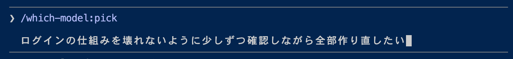
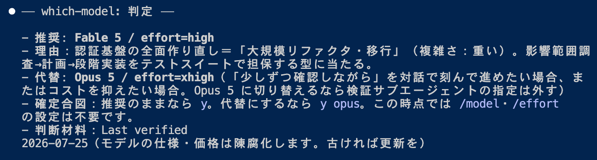
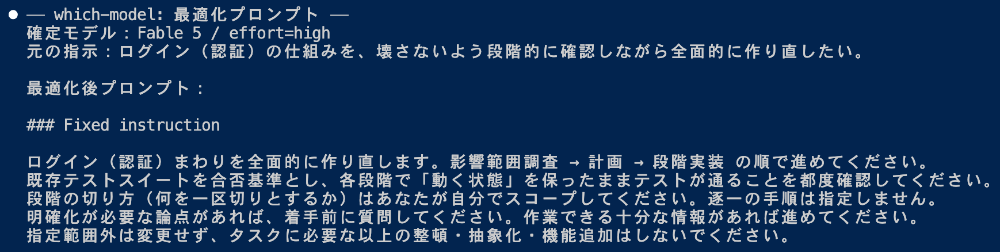

<div align="center">

# which-model

**やりたいことを Claude に伝えると、次の2つを提案する Claude Code 用 skill。**

</div>

**①** タスクに最適なモデルと effort を“理由つき”で<br>
**②** そのモデルに最適化したプロンプト

<div align="center">

提示で止まり <kbd>y</kbd> で確定——切替も実行も、**常にあなたの手に**。

**[すぐ試す](#クイックスタート)** ・ [これは何をするか](#これは何をするか) ・ [仕組み](#仕組み料理人とレシピ本)

</div>


<div align="center">

※ Anthropic 非公式の個人プロジェクト。自動切替はしません（[詳細](#免責非公式について)）。

</div>

<details>
<summary><b>動作例（デモ）を見る</b> — 実際の3ステップのスクリーンショット（クリックで展開）</summary>

「ログインの仕組みを、壊れないように少しずつ確認しながら全部作り直したい」と依頼した実際の流れです。

**1. 依頼する（`/which-model:pick` に、やりたいことを普段どおり書くだけ）**



**2. フェーズ1：推奨モデルと effort が理由つきで提示され、いったん停止する**



**3. `y` を送ると、フェーズ2：確定モデル向けに最適化したプロンプトが表示される（まだ実行はしない）**



*（上は冒頭のみ。実際は各モデルガイドの再利用テンプレートの全文が続きます。テンプレートの構成は
モデルごとに異なります — 例えば Opus 5 向けには `Verification` 節を付けません〈自己検証が既定挙動で、
明示すると過剰検証になるため〉。上の例は Fable 5 が確定モデルなので、長時間実行向けに検証の指定が
入ります。）*

このあと、実行前に `/model claude-fable-5` と `/effort high` のように**モデルと effort の両方**を
設定し（すでに同じ設定なら不要）、**もう一度 `y`**（または表示された
プロンプトを編集して送信）で初めて実行されます。ポイントは **「提示 → （必要なら）設定 → `y` で実行」
の一拍**。skill は提示して停止するところまでしか行いません（`SKILL.md` の絶対規則によるもので、
技術的に実行できないわけではありません）。

</details>

## クイックスタート

> **Claude Code 用のプラグインです。** 以下は Claude Code CLI での導入手順です。Codex・ChatGPT・
> 通常の Claude Chat で呼び出すものではありません。**Claude Desktop の Code タブ**もプラグインに
> 対応しており、設定済みの marketplace にあるプラグインは、`+` ボタンのプラグインブラウザから導入できます。
> 以下の CLI 手順では、プラグイン機構を使うため、Claude Code の比較的新しい版が必要です（`/plugin` が使えること）。

> **Claude Code をまだ入れていない方へ。** 先に[公式のインストール手順](https://code.claude.com/docs/en/setup)で導入してください。
> **Native Install（推奨）なら Node.js は不要**です（npm 経由で入れるときだけ Node.js 22+ が要ります）。
> 例：**Windows は PowerShell** で `irm https://claude.ai/install.ps1 | iex`、**macOS / Linux** は
> `curl -fsSL https://claude.ai/install.sh | bash`。これらの導入コマンドだけは PowerShell やターミナルで実行します。
> インストール方法は変更されることがあるため、最新情報は公式手順を優先してください。

導入できたら、使いたいプロジェクトのフォルダで `claude` を実行して Claude Code を起動します
（この `claude` だけはターミナル／PowerShell で打ちます）。

```sh
claude
```

Claude Code が開いたら、次の3ステップを **ターミナルではなく Claude Code の入力欄**に打ち込みます
（すべて `/` で始まるスラッシュコマンドです。ターミナルでの clone は不要です）。

```text
/plugin marketplace add kazuyakurashima/which-model
/plugin install which-model@kazuyakurashima
/reload-plugins
```

あとは Claude Code の入力欄に `/which-model:pick <やりたいこと>` と打つだけです。

```text
/which-model:pick 認証まわりを大規模リファクタして
```

<details>
<summary>うまくいかないとき・スコープ・更新について（詳しく）</summary>

**`Unknown command: /which-model:pick` と出る**

プラグインは**セッション開始時に読み込まれます**。インストールしただけでは、いま動いている
セッションには反映されません。`/reload-plugins` を実行してください。それでも認識されない場合は、
**新しいセッションを開くか、Claude Code を再起動**してください。

**PowerShell やターミナルで `/plugin ... is not recognized` と出る（`/plugin` が動かない）**

Claude Code の**外**（PowerShell・ターミナル）で実行しています。スラッシュコマンドは Claude Code の
入力欄に打つものです。まず `claude` を実行して Claude Code を起動し、その中で打ち直してください。

**`claude is not recognized` / `command not found` と出る**

Claude Code の導入、または PATH の反映が完了していません。ターミナルを開き直して `claude --version` で
インストールを確認してください（未導入なら上の「まだ入れていない方へ」を参照）。

**インストールスコープ**

`/plugin install` の際にスコープを選べます。**特に理由がなければ User スコープ（既定）**を選んで
ください。全プロジェクトで使えるようになります。Project スコープはそのリポジトリの共同作業者
全員に、Local スコープは自分のそのリポジトリだけに入ります。

**更新の受け取り方**

このマーケットプレイスは Anthropic 公式ではない（＝サードパーティの）ため、**自動更新は既定で
オフ**です。更新は次のどちらかで受け取ります。

- **手動**：`/plugin marketplace update kazuyakurashima` を実行する
- **自動**：`/plugin` → **Marketplaces** タブ → `kazuyakurashima` を選択 → **Enable auto-update**

更新が入ると `/reload-plugins` を促す通知が出ます（または次回起動時に反映されます）。

**アンインストール**（Claude Code の入力欄で）

```text
/plugin uninstall which-model@kazuyakurashima
/plugin marketplace remove kazuyakurashima
```

</details>

<details>
<summary>v3.9.0（旧 standalone 版）を使っていた方へ — 移行の手順（新規の方は読み飛ばしてください）</summary>

**順序が大事です。先に旧版を消すと、新旧どちらも使えない空白ができます。**

1. **先にプラグインを入れる**（上のクイックスタートのとおり）
2. `/reload-plugins`（効かなければ新しいセッションを開く／再起動）
3. **`/which-model:pick <やりたいこと>` が動くことを確認する**
4. **動作を確認できてから**、旧版を退避する（いきなり削除せず、まず移動を推奨）

```sh
mv ~/.claude/skills/which-model ~/.claude/which-model-standalone-v3.9.0.bak
```

**変わること**

- **呼び出し名**：`/which-model` → **`/which-model:pick`**。旧版を退避すると `/which-model` は
  使えなくなります。
- **判断材料の場所**：プラグインに同梱されたものだけを読みます。**プロジェクト側の
  `docs/ai-model-guides/` は読まれません**。
  - 旧版を併用し続ける場合は、旧版がそれを読むので**消さないでください**。
  - プラグインだけを使うなら、プロジェクト側のコピーは不要です（残っていても無視されます）。

**旧 standalone 版に戻したいとき**

```sh
mv ~/.claude/which-model-standalone-v3.9.0.bak ~/.claude/skills/which-model
```

リポジトリから入れ直す場合は `git checkout v3.9.0` を使ってください（`main` の `install.sh` は
4.0.0 では何もインストールしません）。

</details>

## 目次

上の**概要図 → 動作例 → クイックスタート**が最重要の3つです。もっと知りたいときは、以下から必要な項目へ。

- [これは何をするか](#これは何をするか)
- [仕組み（料理人とレシピ本）](#仕組み料理人とレシピ本)
- [セットアップ（詳細）](#セットアップ詳細)
- [使い方とコツ](#使い方とコツ)
- [設計上の割り切り（既知の制約）](#設計上の割り切り既知の制約)
- [カスタマイズについて](#カスタマイズについて)
- [保守終了の方針](#保守終了の方針)
- [付録：CLAUDE.md 追記スニペット](#付録claudemd-追記スニペット任意本運用では非推奨)
- [ライセンス](#ライセンス)
- [免責・非公式について](#免責非公式について)

## これは何をするか

Claude Code で開発していると、指示のたびに「どのモデルが最適か」「プロンプトをそのモデル向けに
どう書くか」で迷い、選定を誤ると手戻りが起きます。この skill は、その2つを半自動化します。

1. あなたが `/which-model:pick <指示>` と入力する
2. skill が指示内容（設計・実装・リファクタ等）と複雑さを判定し、推奨モデルと effort を理由つきで提示して停止する
3. 確定合図を送る（**この時点ではまだモデルを切り替えない**）
   - 推奨モデルのまま → `y`
   - 代替モデルにする → `y opus` / `y fable` / `y sonnet` とモデル名を添える
   - skill は今動いているモデルのまま、確定したモデル向けに最適化したプロンプトを生成し表示して**いったん停止する**
4. ここで `/model` と `/effort` を確定どおりに設定する（すでに同じ設定なら不要。effort は
   セッションをまたいで残るため、前回の設定が残っていないかも確認）
5. 中身を確認し、よければ**もう一度 `y`** を送ると実行される（コピペ不要）。直したいときは表示されたプロンプトを編集して送る

この「表示 → 設定 → `y` で実行」の一拍が暴走を防ぎます。モデル切替を実行直前の1回だけにしているのは、
切替先モデル（特に長時間実行向けの Fable 5）をプロンプト整形という軽作業のためだけに使わないため。
プロンプト最適化は常に、今起動している（切替前の）モデルが行います。

## 仕組み（料理人とレシピ本）

### 概要

**料理にたとえると分かりやすい**です。この skill は「**料理人**」と「**レシピ本**」の2つでできている、
と考えてください。

- **料理人（`skills/pick/SKILL.md`）** … 動作の段取りだけを書いた、Claude への指示書。
- **レシピ本（`references/ai-model-guides/`）** … どのモデルをどう使うかの判断材料。

料理人は判断材料を自分では持たず、レシピ本を読んで「このタスクはどのモデル・どの effort が最適か」を
判断します。判断材料を skill 本体から切り離しているので、**モデルの世代交代にはレシピ本を差し替える
だけで追従できます**。

料理人もレシピ本もプラグインに同梱されているので、インストールすれば両方そろいます。あなたの
プロジェクトに置くものはありません。

### 詳細

<details>
<summary>レシピ本の中身（6ファイル）・タグの意味・補足を開く</summary>

レシピ本（同梱の `references/ai-model-guides/`。このリポジトリでは `docs/ai-model-guides/` が正本）は6ファイル構成です。

| ファイル | 役割 |
| --- | --- |
| `00_index.md` | 全体の使い方・読み込みルール |
| `01_sources_evidence.md` | 根拠台帳（公式主張を source_id で管理） |
| `02_model_selection_matrix.md` | タスク別のモデル/effort 判断表（SKILL.md が毎回読む中核） |
| `03_fable5_prompting.md` | Fable 5 向けプロンプト最適化ガイド |
| `04_opus5_prompting.md` | Opus 5 向けプロンプト最適化ガイド |
| `05_sonnet5_prompting.md` | Sonnet 5 向けプロンプト最適化ガイド |

各ガイドの記述には2種類のタグが付いています。`[Official]` は Anthropic 公式ドキュメントで
裏付けられた事実（`01` の source_id に対応）、`[Heuristic]` は配布元の運用仮説（公式の裏付けなし、
Confidence 付き）です。使う人は `[Heuristic]` を自分の使い方に合わせて書き換えてください。

> このリポジトリの `README.md` は人間向けの説明書で、Claude Code は読み込みません（トークンを
> 消費しません）。Claude への動作指示は `skills/pick/SKILL.md` に、判断材料は同梱の
> `skills/pick/references/ai-model-guides/` にあります（このリポジトリの `docs/ai-model-guides/` が正本で、
> `./tools/sync-bundled-guides.sh` で同梱コピーへ同期します）。
> なお `tools/CODEX_VERIFICATION_PROMPT.md` は配布物ではない開発用ファイル（知識ベースの独立監査用
> プロンプト）で、各プロジェクトへはコピーしません。

</details>

## セットアップ（詳細）

[クイックスタート](#クイックスタート)の3行で完了します。ここでは補足だけ書きます。

### 何がどこに入るか

プラグインとして、次の2つが**一緒に**入ります。プロジェクト側に置くものはありません。

- **料理人（`skills/pick/SKILL.md`）** … Claude への動作指示
- **レシピ本（`skills/pick/references/ai-model-guides/`）** … モデル選定の判断材料（6ファイル）

実体は Claude Code が管理する場所に置かれます。手で配置する必要はありません。

### Windows

`/plugin` コマンドは Claude Code の中で実行するので、**OS を問わず同じ手順**です（4.0.0 では
`install.sh` を使いません）。

### 動かないとき

- `/plugin` が無い → Claude Code が古い可能性があります。更新してください。
- `Unknown command: /which-model:pick` → `/reload-plugins`、それでもだめなら新しいセッションを
  開くか再起動してください（プラグインはセッション開始時に読み込まれます）。
- `/plugin marketplace add` が失敗する → リポジトリ名（`kazuyakurashima/which-model`）を確認して
  ください。

## 使い方とコツ

迷ったとき・重要な設計や大規模作業のときだけ、明示的に呼びます。普段の軽い作業では呼ばず、
設定済みのモデルでそのまま指示すれば十分です。

```
/which-model:pick 複数ユーザー対応のタスク管理アプリを設計して
```

推奨が提示され停止したら、モデルはまだ切り替えずに確定合図を送ります（推奨のまま `y`、
代替に変えたら `y opus` / `y fable` / `y sonnet`）。すると今のモデルのまま最適化された
プロンプトが表示されて停止するので、`/model claude-fable-5` と `/effort high` のように
モデルと effort を確定どおりに設定し（同じ設定なら不要）、中身を確認して**もう一度 `y`** を
送れば実行されます。

呼び方のコツ：

- **必ず行頭に `/which-model:pick` を付けて呼ぶ。** うしろは、やりたいことを普段どおり書くだけでよい
  （例：`/which-model:pick 認証まわりを大規模リファクタして`）。「リファクタして」のような実行命令の
  ままでよく、skill が起動していれば実行はせず「推奨モデル＋最適化プロンプト」を返して止まります
  （止まるのは SKILL.md の絶対規則によるものです。技術的に実行できないわけではありません）。
- **提案が出ず、いきなり作業（ファイル編集など）が始まったら、skill が起動していないサイン。**
  一度止めて、`/which-model:pick …` を行頭から打ち直します。
- **自然文では起動しません。** 4.0.0 では明示的に呼んだときだけ動く設計にしています
  （`disable-model-invocation`）。「どのモデルがいい？」と書いても Claude が勝手に判定を挟むことは
  ありません。必ず `/which-model:pick` から始めてください。
- **通常は、一度呼べば同じセッション内の後続の依頼にも指示が引き継がれます。** 2回目以降で毎回
  コマンドを打ち直す必要はありません（新しい依頼を書けば、フェーズ1からやり直します）。判定が
  始まらないときは、もう一度 `/which-model:pick` を付けて呼んでください。

なお **CLAUDE.md には登録しないことを推奨**します。登録すると毎回自動で判定が走り、日々の開発
テンポを損なうためです（それでも常時参照させたい場合のスニペットは[付録](#付録claudemd-追記スニペット任意本運用では非推奨)を参照）。

## 設計上の割り切り（既知の制約）

現状の Claude Code の仕様と、この skill の設計上、以下を理解した上で使ってください。

- **モデル・effort の自動切替はできない**。skill は推奨を提示するのみで、`/model`・`/effort` の
  設定はユーザーが手動で行います（2026-07 時点の Claude Code の仕様。公式ドキュメントの明文根拠は未確認）。
  effort は `low`〜`xhigh` がセッションをまたいで保存されるため、前回の設定が残っている点にも注意
  （根拠は `01_sources_evidence.md` の S77）。
- **現在のモデルを skill 側から知る手段がない**ため、モデル不一致の自動警告はできません。
- **提示後にポップアップ（AskUserQuestion）を出さない設計**にしています。ポップアップが出ると
  入力欄が塞がれ、モデル切替ができなくなるためです。代わりに一度停止し、`y` を実行の合図とします。
- **skill は読み取り専用ではありません**。`allowed-tools: Read` は Read を事前許可する設定で、
  他のツールを禁止するものではありません。提示だけで止まるのは SKILL.md の絶対規則に従っているため
  であって、技術的な制約ではありません。
- **判定に時間がかかることがあります**。実測では、提示まで数十秒〜2分超かかった例がありました。
  指示の文字数との単純な比例は見られず、セッションのコンテキスト量や effort も影響している
  可能性があります（未検証）。急ぐときは会話履歴の浅いセッションか、軽いモデルで呼んでください。
- **会話ログを丸ごと貼り付けると、推奨の提示を飛ばすことがあります**（既知・完全には直っていません）。
  貼り付けたログの中の `y` や過去のモデル提案を、いまの会話の続きだと読み違えるためです。3.9.0 で
  大きく減らしましたが、確率的に再発します。起きたときは、依頼を短くまとめ直して呼び直してください。
  検証記録は [`tests/regression/`](tests/regression/) にあります。
- **対象は対話型の Claude Code です**。headless（`claude -p`）で複数ターンにまたがる使い方は
  保証していません（フェーズ2でガイドの読み取りが権限で止まることを確認しています）。

## カスタマイズについて

**いまは、判断材料をプロジェクトごとに差し替えることはできません。** skill はプラグインに同梱された
レシピ本だけを読みます。

理由は、安全性と、どの環境でも同じ判断材料で動くことを優先したためです。プロジェクトごとの上書きを
許すと、クローンしてきたリポジトリに置かれたファイルを、それと知らずに判断材料として読んでしまう
余地が生まれます。現行版では、同梱された判断材料だけを読む設計にしています。

**調整したい場合**は、いまのところリポジトリを fork して、`docs/ai-model-guides/` を書き換え、
`./tools/sync-bundled-guides.sh` を実行して自分のプラグインとして使ってください。

プロジェクトごとの調整に需要があることが分かれば、**明示的なオプトイン**として再導入を検討します。
必要な方は Issue で教えてください。

### レシピ本の読み方（fork する方向け）

- `[Official]` タグの記述は公式裏付けがあります（`01_sources_evidence.md` の `source_id` が根拠）。
  モデル世代が変わるまで基本そのままで問題ありません。
- `[Heuristic]` タグの記述は配布元の経験則です。自分の使い方に合わせて書き換えてください。
- 各ファイル冒頭の `Last verified` 日付が古くなったら（目安：1〜2ヶ月）、公式ドキュメントで
  再確認してください。モデルの仕様・価格は頻繁に変わります。

## 保守終了の方針

このツールは、Claude Code に公式のモデル自動選択が実装されれば役目を終えます。そうなったときは、
黙って放置せず次の順序で終了させます。

1. README で非推奨を告知する
2. 公式機能への移行方法を掲載する
3. 最終版をリリースする
4. Marketplace への掲載終了を依頼する
5. **GitHub リポジトリは削除せず Archive する**（既存の利用者が参照できるように）

**「撤退」ではなく「非推奨化と移行案内」**と考えています。インストール済みのコピーを配布元から
強制的に消す手段はないため、静かに消えるより、古くなったことが分かる形で残す方が誠実だからです。

同じ理由で、フェーズ1の提示にはレシピ本の `Last verified` 日付を出しています。更新が止まった版を
使い続けても、判断材料が古いことに気づけるようにするためです。

## 付録：CLAUDE.md 追記スニペット（任意・本運用では非推奨）

> **⚠️ 4.0.0 では、この付録を使うにはひと手間要ります。** 下のスニペットは
> `docs/ai-model-guides/` がプロジェクトにある前提で書かれていますが、4.0.0 のレシピ本は
> プラグインに同梱されており、**あなたのプロジェクトには置かれません**。使う場合は、
> このリポジトリの `docs/ai-model-guides/` を自分のプロジェクトへ手でコピーしてください
> （skill 自体はそれを読みませんが、CLAUDE.md 経由で Claude に読ませることはできます）。

上記の通り本運用では CLAUDE.md への登録は推奨しませんが、skill を使わず常時参照させたい
場合は以下を CLAUDE.md に貼ってください。各行は `02_model_selection_matrix.md` の
記述の要約です（根拠：S1, S6, S9, S10, S16, S25, S29, S65, S67, S68, S71, S73。うち「速い対話・高頻度は
Sonnet 5 / Fable 5 不使用」と「ZDR 前提の代替モデル選択」は公式事実から導く運用判断（`[Heuristic]`）。
タグ・source_id はランタイムのノイズになるため省略。裏付けは `01_sources_evidence.md` を参照）。

```md
## Model routing & prompt optimization

When choosing which Claude model to use, or optimizing a prompt for a specific
model, consult these guides. Read only the file relevant to the current task —
do not load all of them.

- Deciding which model for a task → docs/ai-model-guides/02_model_selection_matrix.md
- Prompting Fable 5 (claude-fable-5) → docs/ai-model-guides/03_fable5_prompting.md
- Prompting Opus 5 (claude-opus-5) → docs/ai-model-guides/04_opus5_prompting.md
- Prompting Sonnet 5 (claude-sonnet-5) → docs/ai-model-guides/05_sonnet5_prompting.md

Quick defaults:
- Unsure / complex agentic coding → Opus 5 (default). Effort defaults to high;
  set xhigh explicitly for coding and agentic work (official guidance).
- On Opus 5, do not add verification instructions ("verify your work", "double-check",
  "use a subagent to verify") — it self-verifies, and these cause over-verification.
  Stating acceptance criteria and which tests must pass is fine.
- Fast, high-frequency, or simple → Sonnet 5 (effort=low for simple lookups). Do not use Fable 5 for these.
- Long, ambiguous, hours-to-weeks, end-to-end → Fable 5 (start at effort=high). Set up timeouts,
  progress, and refusal fallback first (Claude Code falls back automatically).
- If something goes wrong, check context first (prompt clarity, CLAUDE.md, task scope) before
  touching model/effort — the fix is often upstream, not a knob.
- Still not working? Diagnose: skipped a file / didn't run tests / didn't double-check → raise
  effort. Had all the context and clearly tried, still wrong → switch to a larger model.
- Sensitive data under ZDR → avoid Fable 5 (Covered Model, ZDR-ineligible); Opus 4.8 and Sonnet 5 are ZDR-eligible.

All `[Official]` claims are backed by docs/ai-model-guides/01_sources_evidence.md.
```

## ライセンス

このプロジェクトは [Apache License 2.0](./LICENSE) で公開されています。無料で利用・改変・
再配布・商用利用ができます（詳細は `LICENSE` を参照）。

## 免責・非公式について

> **これは Anthropic 非公式の個人プロジェクトです。** Anthropic 社およびその公式製品とは
> 関係ありません（"Claude" は Anthropic の商標です）。掲載する各モデルの仕様・価格は
> `[Official]` タグの範囲で公式ドキュメントに基づきますが、本 skill 自体は公式のものでは
> ありません。本ライセンスは商標の使用権を付与しません（Apache-2.0 §6）。
>
> **「どのモデルか（which model）」を選ぶための skill ですが、モデルを自動で切り替えることはしません。** 現在の
> Claude Code の仕様上それはできず、また設計としても切替はユーザーの手動操作に委ねています。
> この skill がするのは「どのモデルが最適かの提示」と「そのモデル向けプロンプトの最適化」まで
> で、`/model`・`/effort` の設定と実行はあなたが行います。

---

<div align="center">

[](./LICENSE)
[](#免責非公式について)
[](https://github.com/kazuyakurashima/which-model/releases/latest)

</div>
